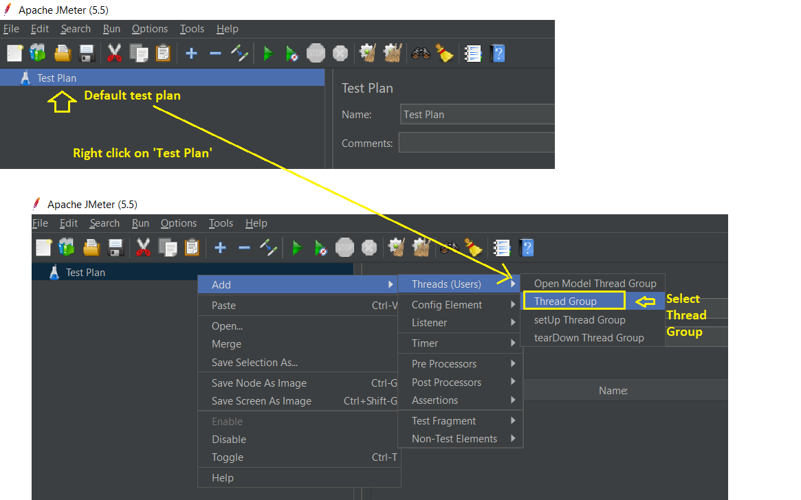
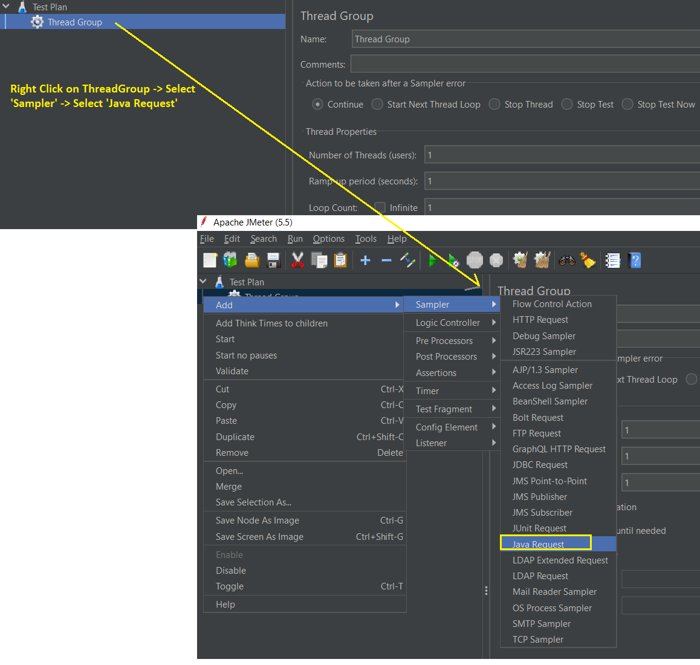
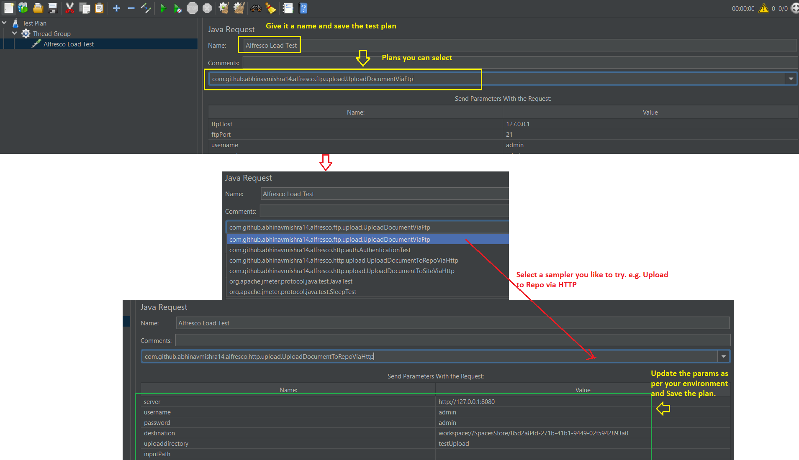

AlfrescoJMeterLoadTestPlugin
============================

This plug-in can be used to test load on alfresco for content uploads using jmeter's java request sampler
------------------------------------------------------------------------------------------------------------

#### You can use the build script to deploy the plug-in to JMeter. Build script will deploy the jar and its dependencies to $JMETER_HOME/lib/ext directory.
   
It will also deploy the `config.properties` to `$JMETER_HOME/bin`. If plug-in will not find this property file at runtime then internal property file will be used by the plug-in.

#### Set the environment variable as "JMETER_HOME".

JMeter plug-in will use the properties file (`config.properties`) deployed at `$JMETER_HOME/bin` to populate the initial info in the JMeter Java Request Sampler GUI.
    
    
#### Following samplers are available

- Upload to a Alfresco Share Site using HTTP
- Upload to Alfresco repository folder using HTTP
- Upload to Alfresco repository via FTP

#### How to deploy?

- Clone the git repo `git clone https://github.com/abhinavmishra14/AlfrescoJMeterLoadTestPlugin.git`
- Open `build.xml` and update the location of your JMeter Installation using updating the value of `jmeter.home` property.
- Run ant build: `ant deploy-plugin`
	- From eclipse, you can right click on `build.xml` -> select `deploy-plugin` and click run.
- Plug-in and required libraries will be deployed to `$JMETER_HOME/lib/ext` folder

#### How to use the plug-in?

- Open command prompt and go to your JMeter install path.
- Change directory to 'bin', e.g.: D:\Java\apache-jmeter-5.5\bin
- Run `jmeter.bat` from command prompt to start the JMeter
- A default test plan named 'Test Plan' will be available. 
   

        
       
        
    

- Add a new 'Thread Group' and keep all settings as default. You can increase the threads and ramp up time to leverage the concurrent users test scenario.
	- Right click on 'Thread Group' -> Select 'Sampler' -> 'Java Sampler'
	  

        
         
        
       

	- Select the Sampler of your choice e.g. Upload to Repo via HTTP 
	   

        
         
        
       

	- Run the plan
